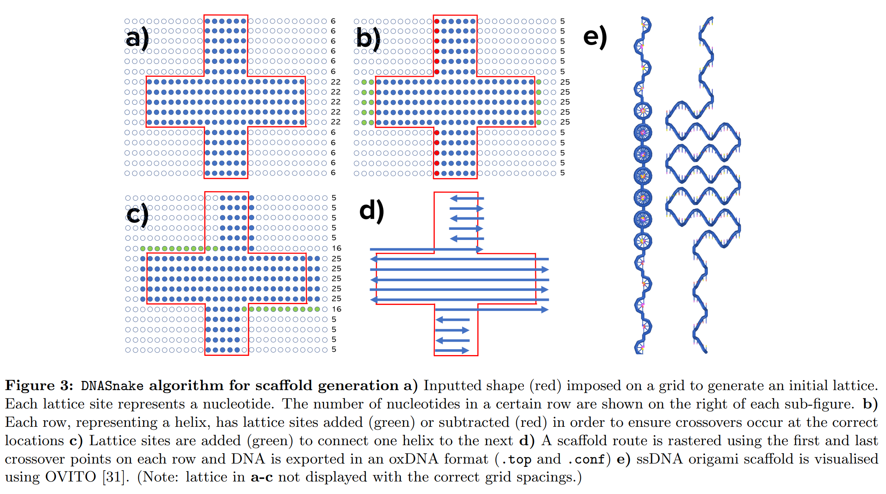
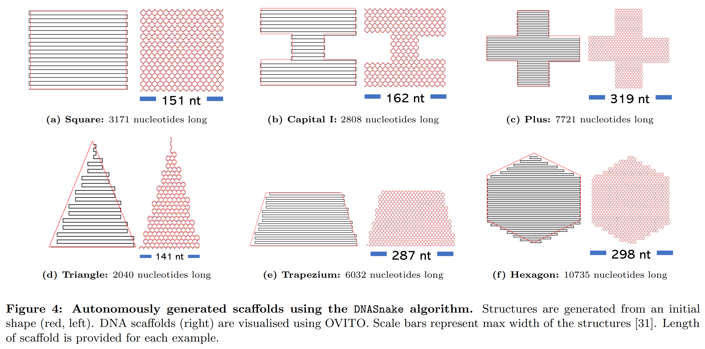

# `DNASnake` Summary

Automated DNA origami scaffold generation for a 2D polygon.

Polygon limits:
- must be symmetrical
- must not split horizontally (e.g. a star), hence can not contain holes

## Usage

```
pip install .
cd protocols/lattice-route/   
python DNA_Snake.py
```

## Description

See **`DNASnake_steps.ipynb`** to understand the algorithm implemented to generate a scaffold route.

Although, a quick summary:

  1. Generate lattice from polygon (each lattice site = nucleotide)
  2. Quantise number of lattice sites on each row (DNA twist between first and last nucleotide must roughly equal an odd multiple of 180 turns)
  3. Connect rows by adding/removing sites and shifting lattice sites
  4. Calculate `DNASnake` scaffold route from first and last lattice site on each row
  5. Export to file (currently either the oxDNA format (`.top` and `.conf`) or LAMMPS format (`.dump`))

### The algorithm

*Extracted from my undergraduate research placement report - Shanil*

### Exemplar outputs

*Extracted from my undergraduate research placement report - Shanil*

- Further `.pdf` with examples in *docs* folder above
